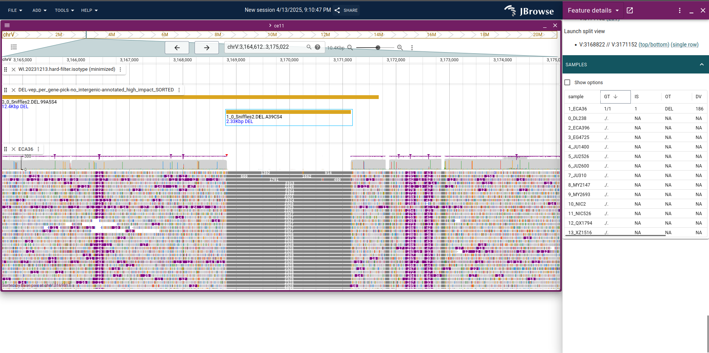

# celegans_jb2_demo

The JBrowse 2 biocuration demo used C. elegans data

This is an expanded instance loading several extra datasets including

- 14 C. elegans PacBio assemblies (manually downloaded from NCBI)
- The CGC1 assembly (manually downloaded from NCBI)
- A Cactus multi-way alignment of the above
- CaeNDR VCFs and short-read datasets for C. elegans

## Slides

A short demo of different functions as a slide deck are here

https://docs.google.com/presentation/d/1tPpwIqvQ5USPvLAuEtWmTZWCFVCizjL1BaVpTTYXeoM/edit?usp=sharing

